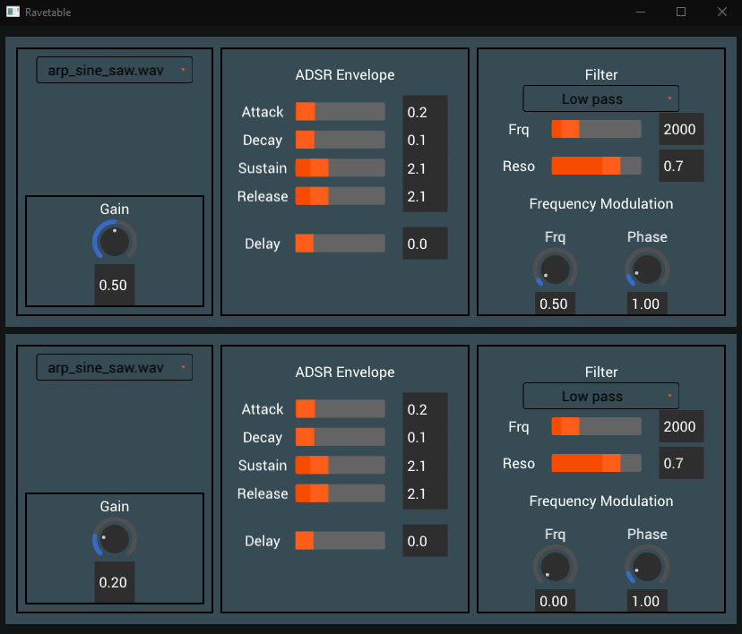

# Ravetable

### Rust + Wavetable = Ravetable 🦀

For CS 410P/510 Computers, Sound and Music (Spring 2021) at Portland State University

## Building
This program is written in Rust, so you'll need a modern Rust (stable) toolchain in order to build it. The easiest way is with [Rustup](https://rustup.rs/).

Ravetable builds with no further intervention on Windows and OSX beyond `cmake` in PATH and the standard platform build tools (XCode, VS). On Linux, you may need these following packages (as retrieved from OpenSUSE, they may be available in slightly different names in other distros):

- Mesa-libGL1 and Mesa-libGL-devel
- libX11-devel
- alsa-devel

This program is fully tested on Windows, Mac, and minimally on Linux. It should be totally cross-platform compatible, but we have found the GUI to fail on Linux machines with really old GPUs.

Once you've obtained the rust toolchain and relevant packages, run it with `cargo run` which should currently work on every major platform via the wgpu backend this project prompted. 

## About Ravetable

Ravetable is a basic, but totally complete, wavetable monophonic synthesizer capable of dynamically importing and transparently utilizing the wavetable sample libraries for modern professional wavetable synths such as Serum. It features two independent oscillators capable of dynamically loading user-provided wavetable sample, which are both triggered via computer-keyboard-as-midi-keyboard setup. The home-row keys on your keyboard are arranged in a C scale beginning with the "A" key tied by default to C5. The upper QWERTY row is logically arranged to serve as the sharp/flat row in approximately the same pattern as a piano. The Z/X keys on the keyboard will shift octaves (within reason).

There are two oscillators which can be dynamically loaded with any user-provided wavetable. The requirements for a workable user sample are listed following:

1) Ravetable only loads .wav files with `f32` samples. Adding other formats would be relatively trivial future work when time is of no constraint.

2) Ravetable expects precisely one cycle of the wave, i.e. one wave period from start to finish. A properly constructed wave should both start and end at 0 to prevent audio artifacts. It expects the wave file to begin and end at precisely a zero-crossing.

3) Ravetable only analyzes the `/wavetable` subdirectory, so all user wavetable samples must be placed directly inside before runtime.

Ravetable offers multiple wavetable-specific presets that was created in Serum's wavetable editor, as well as traditional expected oscillators such as sine/saw and square waves. Users may load custom samples by placing the .wav files into the `/wavetable` subdirectory next to the built-in samples before launching the program, then choosing them in the GUI.

Both oscillators come with a default low-pass filter capped at 15khz to prevent runaway harmonics from damaging speakers, headphones, or ears. GUI to optionally configure this filter will be added in the future.

Each oscillator also has its own user-configurable adaptive-IIR filter (adapted from JUCE[1]) allowing for the benefits of IIR while allowing modulation of the filtered frequency without requiring a replacement of IIR coefficients and related audio artifacts. They can be turned off by setting "Freq" knob to zero.

Finally, both oscillators have independent traditional ADSR envelopes with additional delay offset that function in the expected ADSR manner. As Ravetable is monophonic, the ADSR resets upon each new note triggering via MIDI.

[1] JUCE documentation: https://docs.juce.com/master/classdsp_1_1StateVariableTPTFilter.html. It also led me to the discovery to [this awesome book/documentation](https://www.native-instruments.com/fileadmin/ni_media/downloads/pdf/VAFilterDesign_1.1.1.pdf) which I tried reading, but could barely understand.

### What I did, how it went & future work

Rust's GUI ecosystem is extremely immature, and the windowing systems underlying have their own event loop restrictions. Ravetable is built on top of an experimental branch of [`tuix`](https://github.com/geom3trik/tuix) with wgpu support and has been driving the development of said branch and [`tuix`](https://github.com/geom3trik/tuix) in general. Likewise, the advice from [`tuix`](https://github.com/geom3trik/tuix) maintainers has been of great help throughout the development of this project.

There are several features that are already implemented (or trivially-implementable), but yet to be exposed in the GUI due to lack of support in [`tuix`](https://github.com/geom3trik/tuix) that required more extensive refactoring than this project had time. Ravetable is already designed to generically add/remove oscillators and attached filters. It also already internally operates via the MIDI spec and can be easily adapted to support generic MIDI hardware. Those are two obvious features I plan to add in the near future. On top of it, some of the filter capabilities are not wired in/exposed yet. LFO already supports forms other than sine waves, and multitudes of effects can be built using it.

The messaging bus and events are quite primitive still. I came across [this neat article by Devin Brite](https://dwbrite.com/blog/post/rust%20enums%20by%20example) about Rust enums which coincidentally talked about audio systems about two days before the project due date, and work on refactoring to enum-based system is still in progress. Originally, Ravetable effects were implemented via dynamic trait objects, which incur a runtime cost due to the dynamic dispatch requirements. The ability to emulate dynamic dispatch via trivial Rust `match` improved the performance, but more importantly made the code flexible in a manner that is easier to work with.

Testing in the project is mainly done by running it and listening to the output, as it has been the most effective way to find out if something's working correctly. I wasn't too sure of how to productively write automated tests for most of this crate.

That said, I am very happy with the result! It is very satisfying to start with writing low-level audio code and building on top of it into a functional synth that is already able to produce really cool sounds.

## License

This program is licensed under the "ISC License". Please see the file LICENSE in the source distribution of this software for license terms.
